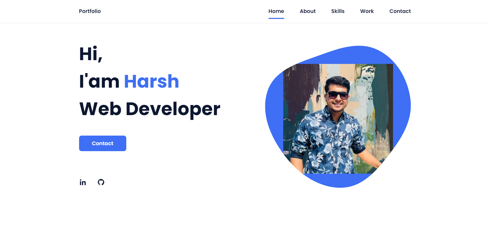

# Portfolio Responsive Complete

This is a personal portfolio website built using HTML, CSS, and JavaScript. It showcases my skills, projects, and achievements in the field of web development. The portfolio is designed to provide an attractive and user-friendly interface, allowing visitors to learn more about me and my work.

# Features

1.Responsive Design
2.Project Showcase
3.Skills Highlight
4.About Me
5.Contact Form